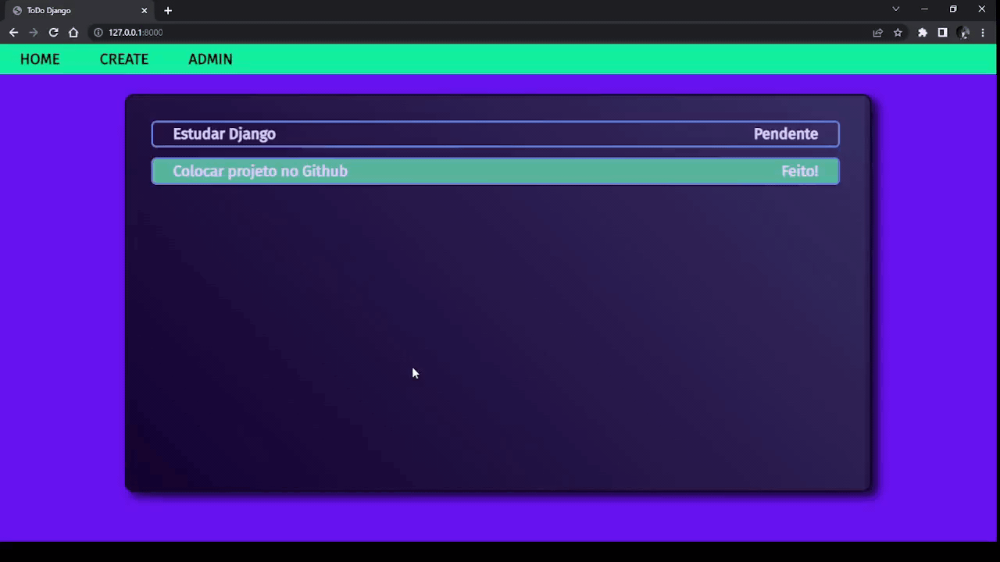

# **To Do App**
# Overview
## To do app is an application made with Django Framework that allows you to add task you'd like to achieve with some descriptions with a fancy design. (It is also a complete CRUD application)
<br/>



# Installation
## if you would like to try it, just perform the following steps:

### Step 1 - Go to a desire folder in your terminal and paste:
```git
git clone https://github.com/darkgx207/Django_ToDoApp.git
```
### Step 2 - activete a virtual environment and install the dependencies.
```
python -m venv venv    

.\venv\Scripts\Activate

pip install -r requirements.txt
```


### Step 3 - inside Django_ToDoApp run:
```
python manage.py makemigrations
python manage.py migrate
```
### Now you're able to start the local server and test it
```
python manage.py runserver
```
### Step 4 - In your browser's url field , type **localhost:8000**

## Now you're able to enjoy the application
<br>

#### **DO NOT** forget the step 2, it is essential, otherwise, our application will not work properly.